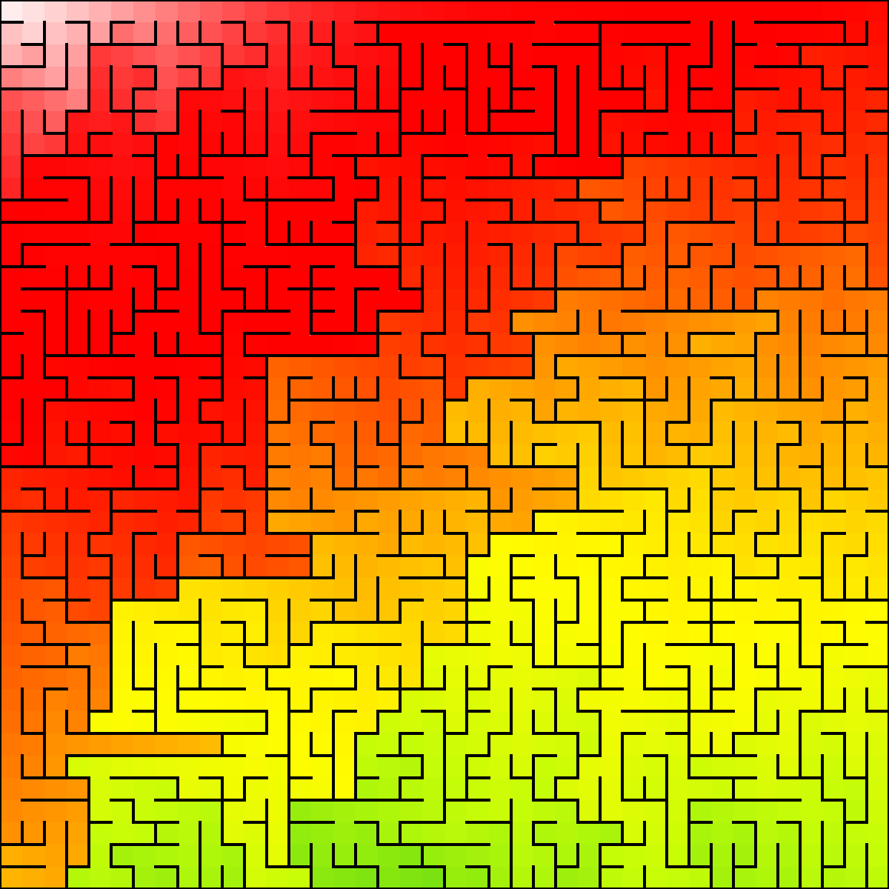
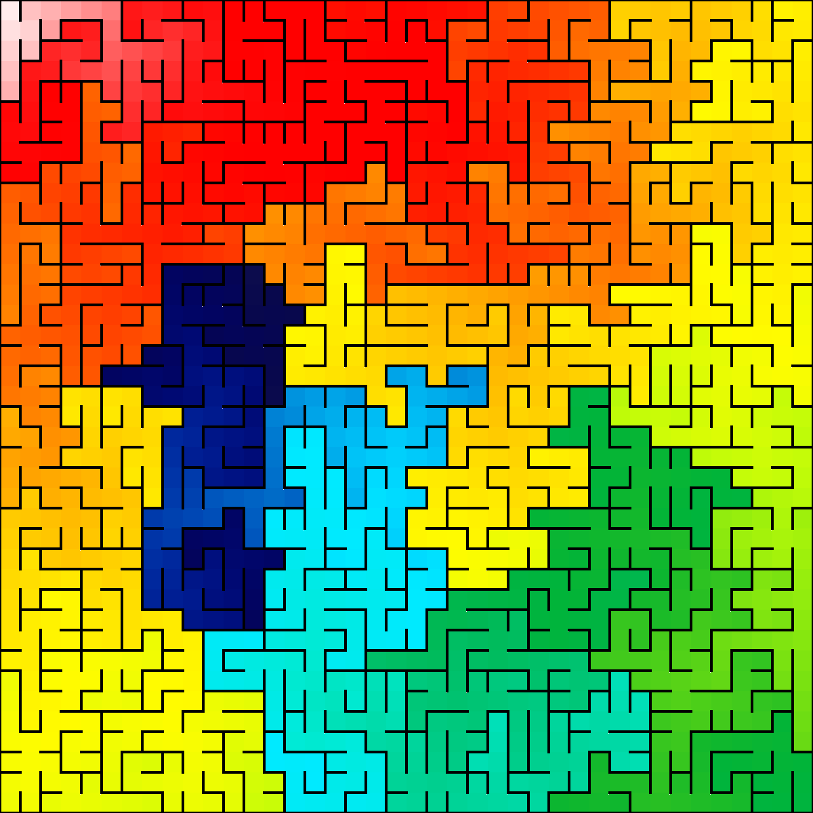

# Go-mazing

This is a personal learning project used to help me explore the Go programming language.  I'm sure I have done many 
things in this project that do not follow best practices in Go or that are out-right wrong.  You have been warned.

The inspiration for this project is "Mazes for Programmers, Code Your Own Twisty Little Passages" written by Jamis
Buck and published by The Pragmatic Bookshelf.  I highly recommend that you check out the book.  Jamis does a
wonderful job describing the algorithms used for building and solving mazes.
[Mazes for Programmers, Code Your Own Twisty Little Passages](https://pragprog.com/book/jbmaze/mazes-for-programmers)

Heatmap schemas are from https://github.com/dustin/go-heatmap

Sample maze generated with Sidewinder algorithm

Sample maze generated with Random Walk algorithm

